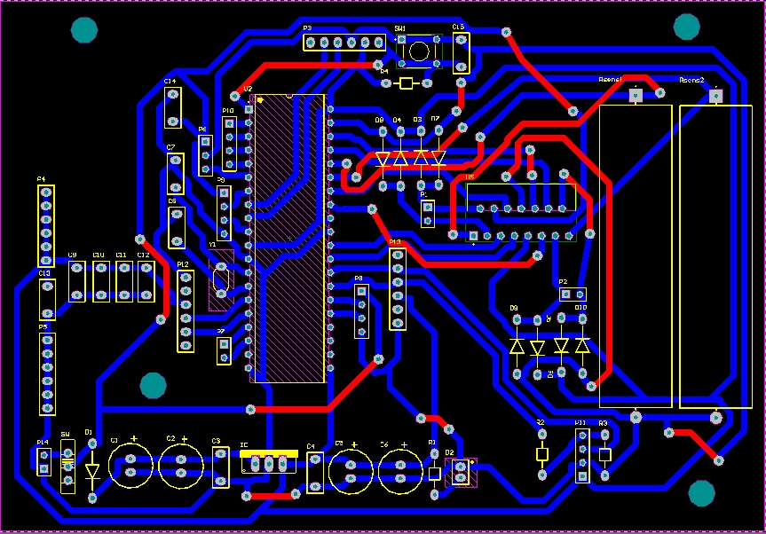
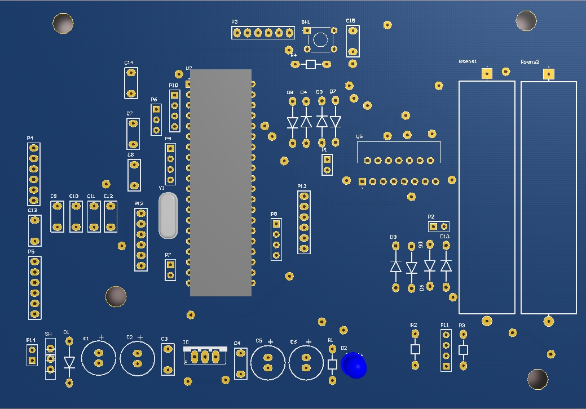

# Autonomous Mini Tank Control System

##  Project Overview
This project involves the development of an autonomous, tracked robotic vehicle (Mini Tank) controlled by a **dsPIC30F4013** microcontroller. The system is designed to navigate its environment independently by constantly scanning for obstacles and making real-time pathfinding decisions.

The tank integrates both analog infrared and digital ultrasonic sensors to calculate distances, uses PWM to drive the motors, and is remotely activated via a Bluetooth serial (UART) connection.
## Custom PCB Design (Altium Designer)

To accommodate all necessary components, including the microcontroller, motor drivers, and sensor arrays, a custom double-sided printed circuit board (PCB) was designed.

### 2D PCB Routing
This view demonstrates the trace routing across the top (red) and bottom (blue) layers, including necessary via placements and component footprints.

### 3D Board Visualization
The 3D model was generated to verify component placement and ensure no mechanical collisions prior to manufacturing.

##  Hardware Architecture
*   **Microcontroller:** Microchip dsPIC30F4013 (10MHz crystal, `XT_PLL4`)
*   **Sensors:**
    *   **1x Sharp GP2Y** (Analog IR Distance Sensor) - Front obstacle detection
    *   **2x HC-SR04** (Digital Ultrasonic Sensors) - Left and right obstacle detection
*   **Actuators:**
    *   DC Motors (Track drive system controlled via PWM)
*   **Communication:** Bluetooth Module (HC-05/HC-06) connected via UART2

##  Firmware & Peripheral Utilization (C Language)
The firmware relies heavily on bare-metal C programming, utilizing multiple hardware peripherals to ensure non-blocking, real-time execution:
*   **Hardware Timers & Interrupts:**
    *   `TMR1` & `TMR2`: System tick and precise delay generation (milliseconds & microseconds).
    *   `TMR3`: Base timer for Motor PWM generation.
    *   `TMR4` & `TMR5`: Dedicated timers for measuring the precise `ECHO` pulse width from the HC-SR04 sensors.
*   **12-bit ADC Module:** Configured with `_ADCInterrupt` to continuously read the analog voltage from the Sharp GP2Y sensor and convert it to distance (cm) using a non-linear power function.
*   **UART2 Module:** Configured to receive start commands (`"ON"`) via Bluetooth and transmit debugging telemetry back to the user.

##  Navigation Logic
1.  **System Standby:** The tank waits for the `"ON"` command via Bluetooth UART.
2.  **Forward Movement:** As long as the front IR sensor reads a clear path (`> 12 cm`), the tank moves forward.
3.  **Obstacle Avoidance:** If an obstacle is detected in front (`< 12 cm`), the tank stops.
4.  **Path Decision:** It compares the distances measured by the Left and Right HC-SR04 sensors. The tank will automatically rotate towards the side with more open space, recalculate, and resume forward movement.
